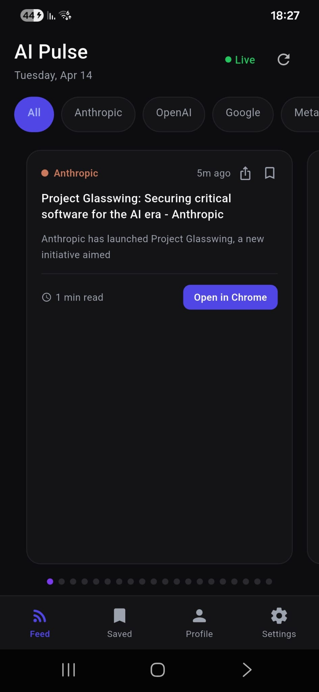
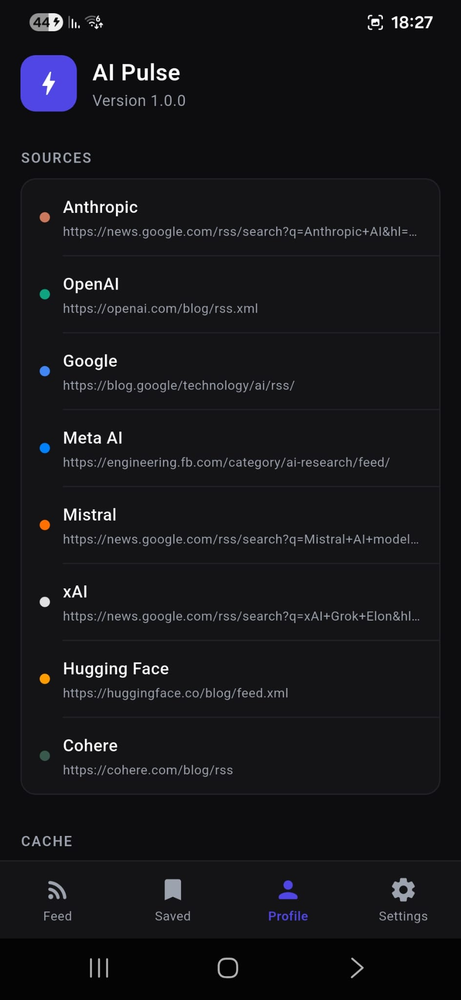
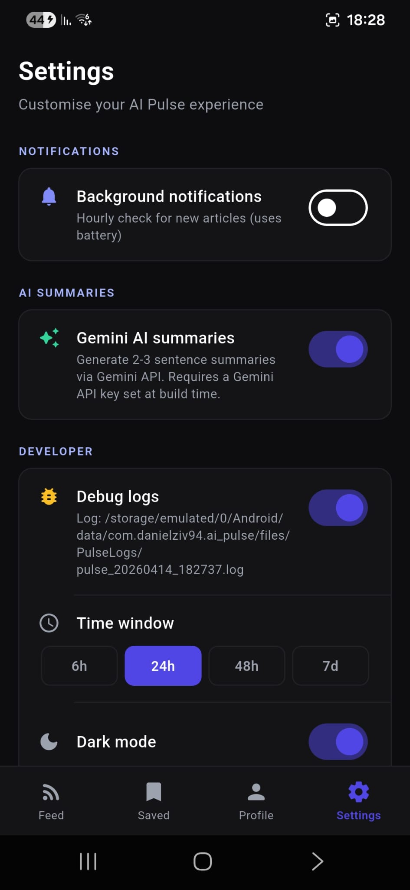

<div align="center">

# AI Pulse

**Personal dark-themed AI news reader for Android**

[](https://flutter.dev)
[](https://dart.dev)
[](https://developer.android.com)
[](LICENSE)

Built by [@danielziv94](https://github.com/danielziv94) · Personal use only · Not for distribution

</div>

---

## Screenshots

<div align="center">



</div>

---

## Features

- **5 AI company sources** — Anthropic, OpenAI, Google, GitHub, Cursor  
- **Gemini 2.5 Flash summaries** — 4-5 sentence paragraph per article, cached locally so each article only calls the API once  
- **Shimmer loading** — smooth animated placeholder while summaries are generating  
- **Swipeable card feed** — peek-style PageView with animated dot indicators  
- **Source filter pills** — tap any company to show only their articles  
- **Time window** — filter by 6h / 24h / 48h / 7d  
- **Bookmark articles** — saved to local storage, accessible from the Saved tab  
- **Share** — copies URL to clipboard and opens the Android share sheet  
- **Open in Chrome** — always opens articles in the external browser (never in-app WebView)  
- **Hourly background notifications** — WorkManager task checks for new articles and shows a notification when new ones arrive  
- **Dark / Light mode** — persisted across restarts  
- **Debug logging** — writes timestamped logs to `Android/data/com.danielziv94.ai_pulse/files/PulseLogs/` (visible in your file manager without special permissions)  
- **Profile tab** — shows exactly which RSS URL succeeded for each source on last refresh  

---

## Requirements

| Tool | Version |
|------|---------|
| Flutter SDK | ≥ 3.41.6 (stable) |
| Dart SDK | ≥ 3.11.4 |
| Android SDK | minSdk 21 · targetSdk 34 |
| Gemini API key | Free — [get one here](https://aistudio.google.com/app/apikey) |

---

## Quick Start

### 1. Install dependencies
```bash
flutter pub get
```

### 2. Get a free Gemini API key

1. Go to [Google AI Studio](https://aistudio.google.com/app/apikey)
2. Sign in with your Google account
3. Click **Create API Key**
4. Copy the key

The free tier for `gemini-2.5-flash` is generous — summaries are cached locally, so most articles only call the API once.

### 3. Build the release APK
```bash
flutter build apk --dart-define=GEMINI_API_KEY=your_gemini_key_here
```

Output: `build/app/outputs/flutter-apk/app-release.apk`

> The API key is embedded at compile time via `--dart-define`. It is never stored in source code or committed to version control.

### 4. Debug / development run
```bash
flutter run --dart-define=GEMINI_API_KEY=your_gemini_key_here
```

---

## Sideload on Samsung (or any Android)

### Method 1 — ADB (fastest)
1. Enable **Developer Options**: *Settings → About Phone → tap Build Number 7 times*
2. Enable **USB Debugging**: *Settings → Developer Options → USB Debugging → ON*
3. Connect phone via USB cable and trust the connection on the phone
4. Run:
   ```bash
   adb install build/app/outputs/flutter-apk/app-release.apk
   ```

### Method 2 — File Transfer
1. Enable **Install Unknown Apps**: *Settings → Apps → Special App Access → Install Unknown Apps → your file manager → Allow*
2. Transfer the APK to your phone (USB, Google Drive, email, etc.)
3. Open the APK from your file manager and tap **Install**

---

## Project Architecture

```
lib/
├── main.dart                        # Entry point: WorkManager init, Provider, 4-tab nav
├── models/
│   └── article.dart                 # Article model (id, title, url, summary, source, isSaved)
├── theme/
│   └── app_theme.dart               # Dark/light ThemeData + source color map
├── services/
│   ├── rss_service.dart             # Multi-URL RSS/Atom fetcher with per-source fallback chains
│   ├── gemini_service.dart          # Gemini 2.5 Flash summarization (8s timeout)
│   ├── cache_service.dart           # SharedPreferences: summaries, saved IDs, known IDs
│   ├── notification_service.dart    # flutter_local_notifications + WorkManager scheduling
│   ├── background_service.dart      # WorkManager callback: RSS check + notification
│   └── logger_service.dart          # File-based timestamped debug logging
├── providers/
│   └── articles_provider.dart       # ChangeNotifier: all app state (5-slot Gemini semaphore)
├── screens/
│   ├── feed_screen.dart             # Swipeable card feed with source filter + pull-to-refresh
│   ├── saved_screen.dart            # Bookmarked articles list
│   ├── profile_screen.dart          # RSS source status + cache management + about
│   └── settings_screen.dart         # Notifications, AI summaries, debug, theme, time window
└── widgets/
    ├── news_card.dart               # Card: shimmer → summary, share, bookmark, open in Chrome
    ├── source_filter.dart           # Horizontal scrollable source pill buttons
    ├── bottom_nav.dart              # Custom 4-tab nav with burst + scale tap animations
    └── settings_sheet.dart          # (Legacy bottom sheet — settings moved to dedicated tab)
```

---

## RSS Sources

All sources try URLs in order and use the first that returns a valid feed. GitHub repos expose a free Atom feed at `github.com/:owner/:repo/releases.atom` — no auth required.

| Source | Primary Feed | Fallbacks |
|--------|-------------|----------|
| Anthropic | anthropic.com/news/rss | raw GitHub mirror → anthropic.com/rss.xml |
| OpenAI | openai.com/news/rss.xml | openai.com/news/rss → openai.com/blog/rss.xml |
| Google | blog.google/technology/ai/rss | deepmind.google/discover/blog/rss → blog.google/rss → research.google/blog/rss |
| GitHub | github.blog/ai-and-ml/github-copilot/feed/ | github.blog/changelog/feed/ → github.blog/feed/ |
| Cursor | cursor.com/blog/rss.xml | cursor.com/rss.xml → raw GitHub mirror → cursor-changelog.com/feed |

The **Profile → Sources** screen shows the exact URL that succeeded on the last refresh, and highlights any source that is unavailable.

---

## Debug Logging

Enable **Settings → Developer → Debug logs** to write a timestamped `.log` file to your device:

```
Android/data/com.danielziv94.ai_pulse/files/PulseLogs/pulse_YYYYMMDD_HHMMSS.log
```

This path is visible in the **Settings** screen once a log file is opened. On Android 11+ the file is accessible via your file manager under `Android/data/` without needing any special storage permission.

---

## Tech Stack

| Layer | Technology |
|-------|-----------|
| Framework | Flutter 3.41.6 |
| Language | Dart 3.11.4 |
| State management | Provider (ChangeNotifier) |
| HTTP | package:http |
| XML parsing | package:xml |
| Local storage | shared_preferences |
| Notifications | flutter_local_notifications |
| Background tasks | workmanager |
| File paths | path_provider |
| Sharing | share_plus |
| External links | url_launcher |
| AI summaries | Gemini 2.5 Flash (REST API) |

---

## License

MIT — see [LICENSE](LICENSE)

---

<div align="center">
  <sub>Built by <a href="https://github.com/danielziv94">@danielziv94</a></sub>
</div>
